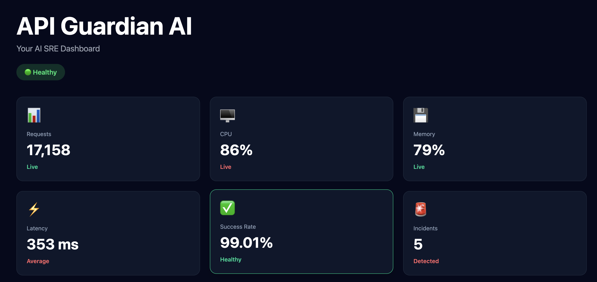
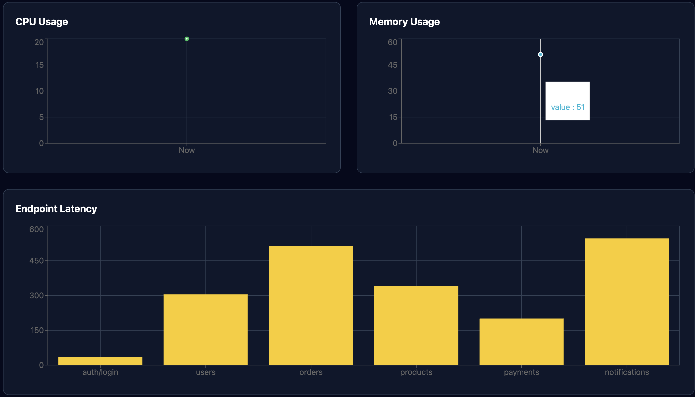
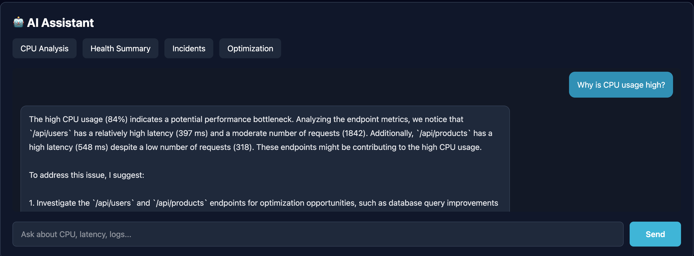
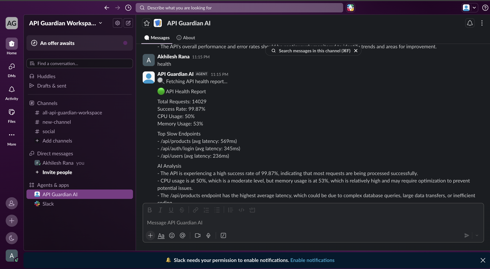

# 🚀 API Guardian AI

An AI-powered API monitoring platform that helps backend developers monitor API health, analyze incidents, receive Slack alerts, and interact with an AI assistant.


---

## 🌐 Live Demo

**Frontend**
> https://api-guardian-ai.vercel.app/

**Backend**
> https://api-guardian-ai.onrender.com/

---

# 📸 Screenshots

## Dashboard



---

## Analytics



---

## AI Assistant



---

## Slack Bot



---

## 📖 Overview

API Guardian AI is an intelligent monitoring platform designed for backend developers and DevOps engineers.

It continuously monitors API health, visualizes system metrics, provides AI-powered insights, sends Slack alerts for critical incidents, and allows developers to interact with an AI assistant for troubleshooting.

---

# ✨ Features

## 📊 Live Monitoring

- Live API health dashboard
- CPU usage
- Memory usage
- Success rate
- Request count
- Endpoint metrics
- Average latency
- Incident detection

---

## 🤖 AI Assistant

Ask questions like:

- Why is CPU usage high?
- Analyze today's incidents
- Summarize API health
- Suggest API optimizations
- Explain slow endpoints

Powered by **Groq Llama 3.3 70B**

---

## 🚨 Slack Integration

Slack Bot supports:

- Health Report
- Incident Analysis
- Summary
- AI Chat
- Performance Optimization
- Interactive Buttons

Automatic alerts are sent when:

- CPU usage exceeds threshold
- Memory usage exceeds threshold

---

## 📈 Dashboard

Real-time dashboard includes:

- Health Cards
- Charts
- Slow Endpoint Table
- AI Recommendations
- Live AI Chat

---

# 🛠 Tech Stack

## Frontend

- React
- Vite
- Tailwind CSS
- Axios
- Recharts

---

## Backend

- Node.js
- Express
- Groq SDK
- Slack Bolt
- Axios

---

## AI

- Groq API
- Llama 3.3 70B Versatile

---

## Deployment

- Vercel
- Render

---

# 🏗 Project Structure

```
api-guardian-ai
│
├── client
│   ├── src
│   │   ├── components
│   │   ├── pages
│   │   ├── assets
│   │   └── services
│
├── src
│   ├── ai
│   ├── controllers
│   ├── jobs
│   ├── routes
│   ├── services
│   ├── slack
│   └── config
│
└── README.md
```

---

# ⚙️ Installation

Clone repository

```bash
git clone https://github.com/akhileshrana079-hub/api-guardian-ai
```

Move inside project

```bash
cd api-guardian-ai
```

Install backend

```bash
npm install
```

Install frontend

```bash
cd client
npm install
```

---

# 🔑 Environment Variables

Backend

```
PORT=3000

GROQ_API_KEY=

SLACK_BOT_TOKEN=

SLACK_APP_TOKEN=

SLACK_SIGNING_SECRET=

SLACK_CHANNEL_ID=
```

Frontend

```
VITE_API_URL=https://api-guardian-ai.onrender.com/
```

---

# ▶ Running Locally

Backend

```bash
npm run dev
```

Frontend

```bash
cd client

npm run dev
```

---

# 📡 API Endpoints

## Health

```
GET /api/health
```

Returns

- CPU Usage
- Memory Usage
- Success Rate
- Endpoint Metrics

---

## AI Chat

```
POST /api/ai/chat
```

Body

```json
{
  "message":"Why is CPU usage high?"
}
```

---

# 💬 Slack Commands

Type inside Slack:

```
menu
```

Displays interactive menu.

```
health
```

AI Health Analysis

```
incident
```

Incident Analysis

```
summary
```

Daily Summary

---

# 🚀 Future Improvements

- PostgreSQL integration
- Redis caching
- Docker support
- Authentication
- Multi-user dashboard
- Historical analytics
- Email alerts
- Grafana integration
- Kubernetes deployment
- WebSocket live updates

---

# 👨‍💻 Author

**Akhilesh Rana**

GitHub

https://github.com/akhileshrana079-hub


---

# ⭐ If you like this project

Please consider giving it a ⭐ on GitHub!